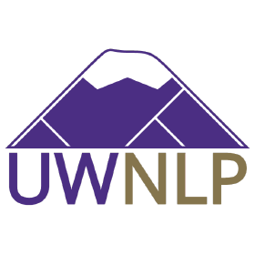
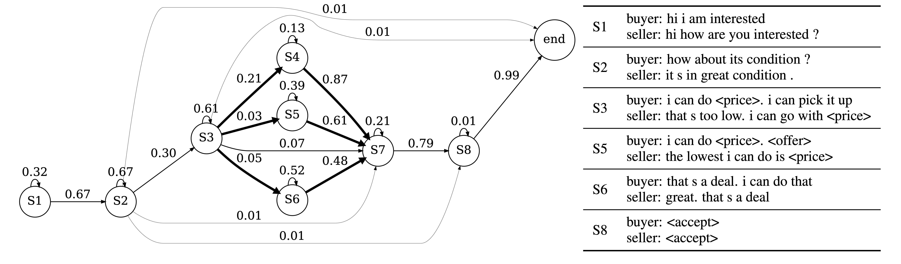
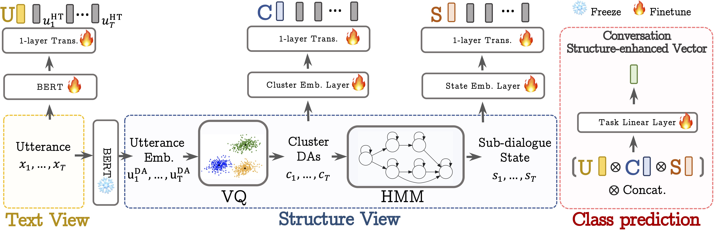

## Unsupervised Learning of Hierarchical Conversation Structure 

  

The offical PyTorch implementation of Three-stream Hierarchical Transformer (THETA). Please refer to our paper for details.
**Unsupervised Learning of Hierarchical Conversation Structure**. [Bo-Ru Lu](https://nlp.borulu.com/), Yushi Hu, Hao Cheng, Noah A. Smith, Mari Ostendorf. EMNLP 2022 Findings.
[[paper]](https://arxiv.org/abs/2205.12244)

This code has been written using PyTorch >= 1.13 and HuggingFace >= 4.21.2. If you use any source codes included in this repository in your work, please cite the following paper. The bibtex is listed below:

```text
@inproceedings{lu-etal-2022-unsupervised,
    title = "Unsupervised Learning of Hierarchical Conversation Structure",
    author = "Lu, Bo-Ru and Hu, Yushi and Cheng, Hao and Smith, Noah A. and Ostendorf, Mari",
    booktitle = "Findings of the Association for Computational Linguistics: EMNLP 2022",
    year = "2022",
    publisher = "Association for Computational Linguistics",
}
```

## Abstract
Human conversations can evolve in many different ways, creating challenges for automatic understanding and summarization. Goal-oriented conversations often have meaningful sub-dialogue structure, but it can be highly domain-dependent. This work introduces an unsupervised approach to learning hierarchical conversation structure, including turn and sub-dialogue segment labels, corresponding roughly to dialogue acts and sub-tasks, respectively. The decoded structure is shown to be useful in enhancing neural models of language for three conversation-level understanding tasks. Further, the learned finite-state sub-dialogue network is made interpretable through automatic summarization.

## An Example of a HMM Graph on Negociation Dialogues.
<p align="center">

</p>
The 8-state topology on CRAIGSLISTBARGAIN dataset. The thicker edges indicate higher levels of negotiation success; in contrast, the thinner edges represent lower levels. Due to space limitations, only 6 state summaries are shown. The detailed topology with all cluster and state summaries is in Appendix D of the paper.


## Model Architecture
<p align="center">

</p>
Overview of THETA conversation encoding. The text of each utterance text is encoded by BERT, and a 1-layer transformer further contextualizes utterance embeddings to generate the text vector U. For structure,
utterances are mapped to K-means dialogue acts (DAs), which are input to an HMM to decode sub-dialogue states. 1-layer transformers are applied to sequences of DAs and sub-dialogue states, yielding cluster vector C and state vector S. The concatenation of U, C and S is fed into a linear layer to obtain the structure-enhanced vector for the predictive task. For simplicity, Emb. and Trans. stand for embedding and transformer, respectively.

## Setup

#### Paths

Create a hidden file named `.env` in the main directory and set the 2 paths as follows.
```bash
# the path to store data, model, and experiment results.
NFS_PARENT_DIR=[path to theta repo]/project_dir
```

#### Option 1: Run THETA using Docker image.
- [Docker link](https://hub.docker.com/r/dapy4372/theta)

```bash
docker run -u root -it --gpus all dapy/theta:v1.0 /bin/bash
```

#### Option 2: Run THETA using Apptainer image.
- Download Apptainer image at [https://roylu-opensource.s3.us-west-2.amazonaws.com/theta/apptainer_image/app.sif](https://roylu-opensource.s3.us-west-2.amazonaws.com/theta/apptainer_image/app.sif)
- You should be able to run the image on Singularity as well.

```bash
# Run apptainer image.
apptainer shell --bind [path of this repo] --workdir pwd --nv app.sif
```

#### Download Preprocessed Data & Trained Models
We also provide the preprocessed data, structure, and trained models.
1. [Data](https://github.com/boru-roylu/THETA_clean/tree/main/project_dir/data)
2. [Clusters (assignments)](https://github.com/boru-roylu/THETA_clean/tree/main/project_dir/assignments)
3. [States (state_assignments)](https://github.com/boru-roylu/THETA_clean/tree/main/project_dir/state_assignments)
4. [Embeddings](https://roylu-opensource.s3.us-west-2.amazonaws.com/theta/embeddings.tar)
5. [Pretrained models](https://roylu-opensource.s3.us-west-2.amazonaws.com/theta/pretrained_models.tar)
6. [Experiments](https://roylu-opensource.s3.us-west-2.amazonaws.com/theta/exp.tar)

1-3 are provided in this github repository.
4-6 are provided in AWS s3. You need to download and uncompress the tar files.
Put all directories under the path `$NFS_PARENT_DIR` which you defined in the hidden file `.env`.

`$NFS_PARENT_DIR` will look like this.
```bash
.
├── assignments
├── data
├── embeddings
├── exp
├── pretrained_models
└── state_assignments
```

## (Optional) Prepare Structure
You can skip this step if you can use our pretrained models, embeddings, clusters, states in `$NFS_PARENT_DIR`.
- Pretrain models: `$NFS_PARENT_DIR/pretrained_models`
- Embeddings: `$NFS_PARENT_DIR/embeddings`
- Clusters: `$NFS_PARENT_DIR/assignments`
- States: `$NFS_PARENT_DIR/state_assignments`

#### Step 1: Domain-adaptive Pretraining for In-domain Embeddings.
The pretrained models can be downloaded in `$NFS_PARENT_DIR`

```bash
# ABCD
# Trained model will be stored in 
# $NFS_PARENT_DIR/exp/abcd/pretrain/bert_init_from_bert-base-uncased_job_name-bash/seed-42/checkpoint-5000/fp32
# Move the trained model to $NFS_PARENT_DIR/pretrained_models/abcd/bert-base-uncased-abcd-wwm
bash pretrain/abcd/bert.sh
```

```bash
# Craigslist
# Trained model will be stored in 
# $NFS_PARENT_DIR/exp/craigslist/pretrain/bert_init_from_bert-base-uncased_job_name-bash/seed-42/checkpoint-5000/fp32
# Move the trained model to $NFS_PARENT_DIR/pretrained_models/craigslist/bert-base-uncased-craigslist-wwm
bash pretrain/craigslist/bert.sh
```

#### Step 2: Extract Embeddings and Cluster Embeddings
```bash
bash data_scripts/abcd.sh --task_name pretrain
python prepare_structure/cluster/prepare_cluster_abcd.py
```

```bash
bash data_scripts/craigslist.sh --task_name pretrain
python prepare_structure/cluster/prepare_cluster_craigslist.py
```

#### Step 3: Learn HMM Topologies via State-splitting
Note: Finishing clustering step is required before proceeding this step.
```bash
bash data_scripts/abcd.sh --task_name pretrain
python prepare_structure/state/prepare_state_abcd.py
```

```bash
bash data_scripts/craigslist.sh --task_name pretrain
python prepare_structure/state/prepare_state_craigslist.py
```

## Train THETA

```bash
# ABCD
export SEED=21; bash train_scripts/finetune/abcd/cls-cluster-state-structure-hibert.sh --embedding_name bert_mean_pooler_output --num_clusters 60 --num_states 12
```

```bash
# CraigslistBargains
export SEED=21; bash train_scripts/finetune/craigslist/cls-cluster-state-structure-hibert.sh --embedding_name bert_mean_pooler_output --num_clusters 14 --num_states 8
```

## (Optional) Raw Data

#### Action-Based Conversations Dataset (ABCD)
Download the Action-Based Conversations Dataset (ABCD) dataset from the [official repository](https://github.com/asappresearch/abcd) ([Chen et al., 2021](https://arxiv.org/abs/2104.00783)). [abcd_v1.1.json.gz](https://github.com/asappresearch/abcd/raw/master/data/abcd_v1.1.json.gz).

#### CraigslistBargains
Download the preprocessed pickle file ([strategy_vector_data_FULL_Yiheng.pkl](https://drive.google.com/open?id=1WxCvZ__ulT--VRL1oijVCa7tTj8SRydx&authuser=0&usp=drive_link)) of CraigslistBargains dataset from Google drive provided in [DialoGraph repository](https://github.com/rishabhjoshi/DialoGraph_ICLR21) ([Joshi et al. 2021](https://arxiv.org/abs/2106.00920)).

## Bug Report
Feel free to create an issue or send email to [roylu@uw.edu](mailto:roylu@uw.edu).

## License
```
copyright 2022-present https://nlp.borulu.com/

Permission is hereby granted, free of charge, to any person obtaining a copy 
of this software and associated documentation files (the "Software"), to deal 
in the Software without restriction, including without limitation the rights 
to use, copy, modify, merge, publish, distribute, sublicense, and/or sell 
copies of the Software, and to permit persons to whom the Software is 
furnished to do so, subject to the following conditions:

The above copyright notice and this permission notice shall be included in all 
copies or substantial portions of the Software.

THE SOFTWARE IS PROVIDED "AS IS", WITHOUT WARRANTY OF ANY KIND, EXPRESS OR 
IMPLIED, INCLUDING BUT NOT LIMITED TO THE WARRANTIES OF MERCHANTABILITY, 
FITNESS FOR A PARTICULAR PURPOSE AND NONINFRINGEMENT. IN NO EVENT SHALL THE 
AUTHORS OR COPYRIGHT HOLDERS BE LIABLE FOR ANY CLAIM, DAMAGES OR OTHER 
LIABILITY, WHETHER IN AN ACTION OF CONTRACT, TORT OR OTHERWISE, ARISING FROM, 
OUT OF OR IN CONNECTION WITH THE SOFTWARE OR THE USE OR OTHER DEALINGS IN THE 
SOFTWARE.
```
